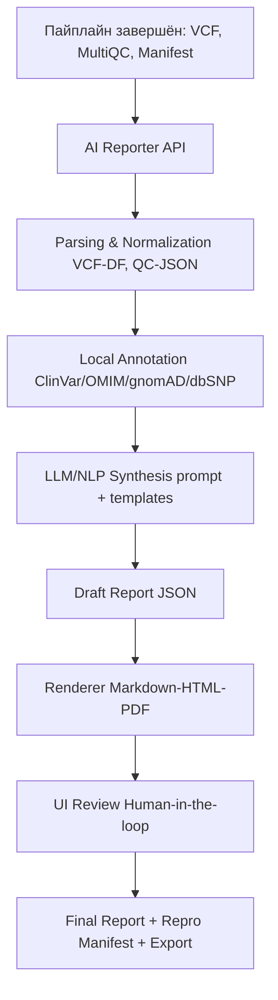

# Дизайн ML системы — GenomeAI AI Reporting Module

### 1. Цели и предпосылки

#### 1.1. Зачем идем в разработку продукта
- Сократить время от завершения пайплайна до готового интерпретированного отчёта с **дней → до минут**.
- Снизить трудозатраты экспертов за счёт автоматизации интерпретации VCF/QC.
- Повысить воспроизводимость и качество коммуникации результатов для клиники и R&D.

#### 1.2. Бизнес-требования и ограничения
- Формирование структурированного отчёта (JSON→HTML/PDF): резюме, QC, таблица клинически значимых вариантов, интерпретация, манифест воспроизводимости.
- Экспорт отчётов и метаданных в LIMS/ELN через API/webhook.
- Работа **on-premise**, без вывода ПДн за периметр; соответствие локально применимым регламентам.
- Целевые ориентиры итерации: черновик отчёта ≤ **2 мин/образец**; ≥ **90%** соответствия ключевых интерпретаций экспертным отчётам; принятие пилота ≥ 2 командами (клиника/R&D).

#### 1.3. Что входит в скоуп проекта/итерации, что не входит
**Входит:**
- Обработка артефактов пайплайна GenomeAI: `VCF`, `MultiQC`, JSON-манифест (версии).
- Локальная аннотация по снапшотам ClinVar/OMIM/gnomAD/dbSNP/dbNSFP.
- NLP/LLM-свёртка фактов в связный текст; шаблоны Markdown→HTML→PDF.
- Human-in-the-loop: просмотр, правки, утверждение.
- Интеграция с LIMS/ELN (API/webhook).
- **Интерпретационные диагностические функции**: подсветка клинических корреляций и формирование предположений для врача (финальное решение остаётся за клиницистом).

**Не входит:**
- Модификация Nextflow-пайплайнов.
- Визуализация BAM/CRAM на уровне genome browser.
- Обучение моделей «с нуля» (в итерации — инференс/адаптация, возможен fine-tuning).

#### 1.4. Предпосылки решения
- В ядре GenomeAI реализован воспроизводимый путь **FASTQ→VCF**, артефакты и метаданные доступны через S3/API.
- Версии инструментов/контейнеров/референсов фиксируются — база для проверяемых отчётов.
- Горизонт: отчёт на «текущий запуск»; гранулярность — образец; частота — по готовности пайплайна.

---

### 2. Методология

#### 2.1. Постановка задачи
- Тип: интеллектуальная интерпретация результатов генетического анализа и генерация пояснительного отчёта (NLP/LLM + rule-based аннотация).
- Цель: превратить структурированные факты (варианты, QC, источники) в проверяемое текстовое заключение.

#### 2.2. Блок-схема решения

#### 2.3. Этапы решения задачи

**Этап 1 — Подготовка данных (EDA)**
- Сущности:
  - Целевая переменная: корректная интерпретация клинически значимых вариантов в отчёте.
  - Признаки: поля VCF (ген, позиция, тип варианта, zygosity), QC-метрики (coverage, Ti/Tv, duplicates), источники (ClinVar ID, OMIM ID, rsID).
- Источники:

| Данные                       | Источник/витрина     | Качество |
|-----------------------------|----------------------|----------|
| VCF                         | S3: runs/*/artifacts | +        |
| MultiQC summary             | S3: runs/*/artifacts | +        |
| Manifest (версии)           | S3/DB                | +        |
| ClinVar/OMIM/gnomAD/dbSNP   | локальные реплики    | ±        |

- Выход: нормализованные витрины (parquet/csv) для аннотации и генерации.

**Этап 2 — Бейзлайн**

**Этап 3 — MVP**

**Принципы**

